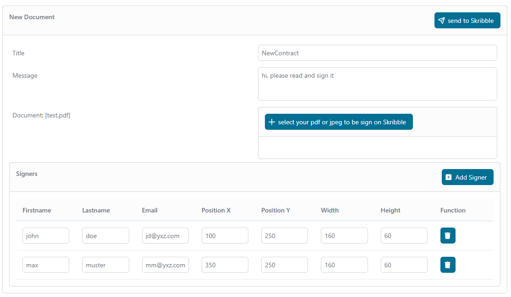
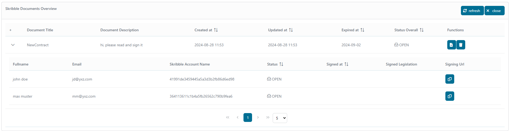
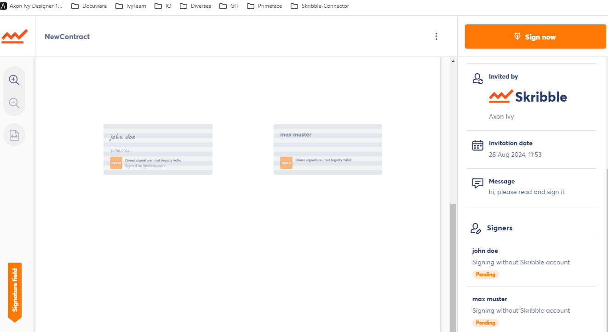
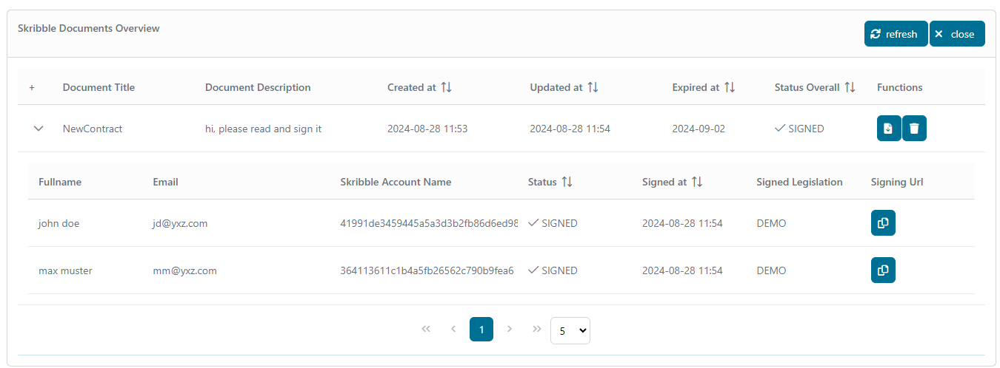

# Skribble-Connector

[Skribble](https://www.skribble.com/de-de/) is a modern digital signature platform that provides legally binding electronic signatures compliant with European laws.  Use our Skribble connector to gain access to the Skribble features, like
 
- creating signatures in a secure and legally compliant way
- monitoring signature processes
 
Just download the connector into your Axon Ivy designer and start the demo process!

## Demo

A new signature requests can be created and monitored via the demo. If a signature request is created, the signature verification will be handled over the platform. 
Each participant has full access to their own documents and can sign or decline them.

On the demo there are two processes: The first process is an easy dialog to create a new signature request and the second shows all the signature request with their own status.

Creating a new Signer Request, upload your document which has to be sign and add your signer.


Loads all your documents from the Skribbleplatform.
If you created successfully a Request you will see it here. 


Document view on the Skribbleplatform as a signer


Refresh the overviewpage and you will see the status on the signer and the overallstatus are changed.


To get a Sign from a signer there are two easy options:
	-set the notify parameter off the signer on true and he will recieve directly a mail from the skribble platform shorty after the request.
	-or if you want notify himself you can disable the notiy and send him the url over your own custom styled email.
	
There are three options for signing verification: SES, AES and QES	


## Setup

Before any signing interactions between the **Axon Ivy Engine** and the **Skribble-Platform** services can be run, they have to be introduced to each other. This can be done as follows:

1. Create an **Account** account: **[here](https://my.skribble.com/business/signup/?lang=en) **

2. Create an **demo API key** for more information jump to the admin documentation: **[here](https://docs.skribble.com/business-admin/api/apicreate#create-api-keys) **

3. Open the `Configuration/variables.yaml` in your Designer and set the username and the apikey from which you get on the skribbleplattform

   ```
	# == Variables ==
	Variables:
	  #set all paramaters for Skribble-connector
	  skribbleConnector:
	    #username
	    username: 'api_demo_xxxxx'   #<-- paste here your username
	    #apikey
	    #[password]
	    authKey: ${decrypt:\u00AF\u00A8...}   #<-- paste here your apikey and encrypt it

   ```

4. Save the changed settings and start a demo process
